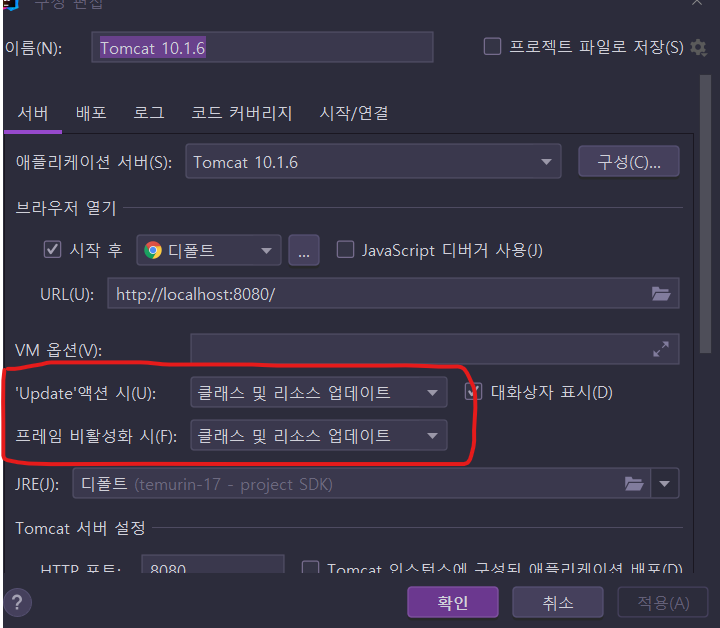
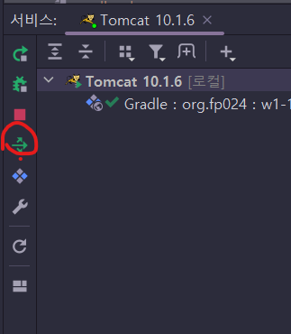
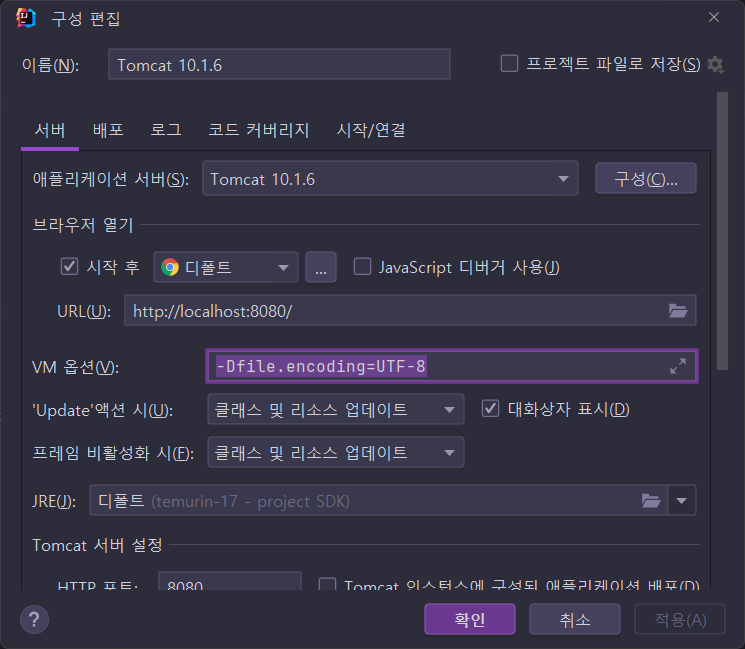

# 1장 웹 프로그래밍의 시작

> 필요할 경우에만 단순하게만 정리하자.  😉
>
> 대부분은 제목만 적을 것 같음. 😄


## 1.1 자바 웹 개발 환경 만들기

* ...

### 웹 프로젝트의 기본 구조

* 음... 뭔가 16페이지 그림이 잘못된 것 같은데. 중간이 `데이터베이스`, 오른쪽에 `서버`가 있어야할 것 같다.
* ...

### 인텔리제이를 이용한 프로젝트 생성

* ...

* Java EE 프로젝트 템플릿을 사용해도 Gradle로 빌드 환경을 만들 수 있었다.

  

  

### 톰켓(Tomcat) 설정과 웹 프로젝트 생성

* ...
* zip파일 다운로드 권장

#### Java Enterprise 프로젝트 생성

* Gretty로 처음부터 구성할까? 했는데.. 책대로 따라가는 게 좋을 것 같아서 JavaEE 템플릿 프로젝트로 만들었다.
* 설정 진행
  * 기본 설정 메뉴 다음에 버전 선택에서 `Jakarta EE 10`을 선택해서 Tomcat 10.1을 사용하기로 했다.
  * Context Root 변경할 때.. 스크롤을 안내리면 메뉴가 잘 안보인다.. Deployment 항목까지 진행했으면 스크롤을 내려보자!
  * IDE 통합이 잘되어있어서 Gretty보단 엄청 편하긴하다.. 👍

* ... 

##### IntelliJ VM 옵션

```
-Dfile.encoding=UTF-8      // 이 옵션은 원래 쓰던 것이고,
-Dconsole.encoding=UTF-8   // 이 옵션은 추가했다.
```


#### 변경된 코드의 반영



* 위의 설정을 했을 때, JSP 변경사항은 즉시 반영됨.

* Servlet 클래스를 변경할 때는 최소 `다시 배포`는 해야하는 듯.. 그렇다고 자동으로 되진 않았음.

  * 기본 값은 ...
    * Update 액션시: `다시 배포`
    * 프레임 비활성화 시: `아무것도 안 함.`

* 책에서도 모두 배포를 누르라고 한다.

  

  배포는 해야함.


#### 서블릿 코드 작성하기

* ...

#### JSP 코드 작성하기

* ...


----

#### ✨ 중간진행 노트

* IntelliJ 로 Tomcat 설정을 했기 때문에 Gretty는 잘 사용하지 않을 수 있지만, 다른 도구를 사용할 때는 Gradle만으로 바로 실행할 수 있기 때문에 설정을 넣었다.
* Log4j2, Lombok 설정을 미리 넣었다.
* Mockito, Spring Test, Spring Web 등을 이용해서 서블릿 테스트 코드를 작성 했다.
  

✨ 서블릿 부터 시작해서 스프링 부트까지 진행하는 다른 책을 동시에 진행하고 있다, 서블릿 테스트 헬퍼 클래스들은 그 스터디 진행하면서 새로 만든 것들임.

✨ 다른 스터디와 서로 교차 검증해가며 코드를 발전시키도록 하자.

---


## 1.2 웹 기본 동작방식 이해하기

### Request(요청) / Response(응답)

* ...

#### HTTP 라는 약속

* ...


### JSP를 이용해서 GET/POST 처리하기

* ...

#### GET 방식은 입력과 조회

* ...

#### POST 방식은 처리를 위한 용도

* ...

* **웹의 파라미터는 모두 문자열**

  

#### JSP의 올바른 사용법

* JSP는 GET/POST 호출을 구분하지 않음.
  * JSP에서 쿼리스트링이나 파라미터를 처리하지 말것, 대신 서블릿에서 처리
  * JSP는 입력 화면을 구성하거나 처리 결과를 보여주는 용도로만 사용할 것.
  * 브라우저는 직접 JSP 경로를 호출하지 않고 서블릿 경로를 통해서 JSP를 보는 방식으로 사용할 것.

* ..


## 1.3 Web MVC 방식

* ...

### MVC 구조와 서블릿/JSP

* ...

#### MVC구조로 다시 설계하는 계산기

* 설계 작업 원칙
  * 브라우저의 호출은 반드시 컨트롤러 역활을 하는 서블릿을 호출하도록 구성
  * JSP는 브라우저에서 직접 호출하지 않도록 하고 Controller를 통해서만 JSP에 접근하도록 구성


### 실습02 POST 방식을 통한 처리 요청

* ...


### 실습03 sendRedirect()

* ...


### PRG 패턴 (Post-Redirect-GET)

* .. 패턴 축약 그대로 
  * POST 처리 요청
  * 처리후 Redirect...
  * 브라우저는 다시 리다이렉트된 주소를 GET


#### PRG 패턴을 이용한 와이어 프레임 작성하기

* ...
* 흐름도를 UI를 포함해서 그려내는데... 
  * https://balsamiq.com/wireframes/desktop 이 회사 제품이 유명한가 보다...


#### Todo 웹 애플리케이션 와이어 프레임 그릭

* 목록 화면 (GET)
  * ...
* 등록화면 (GET)
  * ...
* 등록화면 (POST)
  * ...
* 조회화면 (GET)
  * ...
* 수정/화면 (GET)
  * ....
* 수정 (POST)
  * ...
* 삭제 (POST)
  * ...


#### 구현 목록 정리

* 기능 / 동작방식 / 컨트롤러  JSP의 표를 만든다.

---

#### ✨ 중간진행 노트

확실히 흐름도롤 그리고, 기능 목록 정리표를 잘 작성하는게 중요하긴하다..

* 발사믹 설치할까 말까.. 😓 오래전에도 봤었는데.. 지금은 회사가 많이 큰것 같음.

---


## 1.4 HttpServlet

* ...

#### HttpServlet의 라이프 사이클

* ...

* ✨ 동일한 주소의 서블릿 클래스의 인스턴스는 딱 하나만 생긴다. (해시가 같음.)

  ```
  09:48:27.570 [http-nio-8080-exec-59] INFO  org.fp024.w1.SampleServlet - doGet... org.fp024.w1.SampleServlet@7c2b4d4f
  09:49:00.810 [http-nio-8080-exec-61] INFO  org.fp024.w1.SampleServlet - doGet... org.fp024.w1.SampleServlet@7c2b4d4f
  09:49:06.196 [http-nio-8080-exec-62] INFO  org.fp024.w1.SampleServlet - doGet... org.fp024.w1.SampleServlet@7c2b4d4f
  ...
  ```


### HttpServletRequest의 주요 기능

* ...

#### getParamemter()

* ...

#### getParameterValues()

* ...

#### setAttribute()

* ...

#### RequestDispatcher()

* ...
* 일단은 forward()만 써봤는데...
  * forward(): 현재까지의 모든 응답(Response) 내용은 무시하고 JSP가 작성하는 내용만을 브라우저로 전달
  * include(): 지금까지 만들어진 응답 내용 + JSP가 만든 내용을브라우저로 전달.


## HttpServletResponse의 주요 기능

* ...

#### sendRedirect()

* ...

### 실습01 와이어 프레임의 구현

* 기능 / 동작방식 / 컨트롤러 / 컨트롤러 URL  / JSP 표만들기...
* ✨ 이런 식으로 표만들어보는게 중요함.


### 실습02 TodoListController 구현

* ...


### 실습03 TodoRegisterController의 구현

* ...


## 1.5 모델 (Model)

* ...

### 모델과 3티어

* ....

#### DTO (Data Trasfer Object)

* ...

#### 서비스 객체

* ...

### 실습 04 TodoService 클래스

* 싱글톤을 쉽게 구현하기 위해서 enum을 활용한 것은 새롭다. ✨
  * 다른 스터디에서 Gson 헬퍼 싱글톤 만드려고, 아래와 같은식으로 하기도 했는데...
    * https://github.com/fp024/learning-spring-web-project-by-code/blob/7c0d7dbe4e8efa261e669e9397b40700b3c3b482/part-last/my-board-spring5/src/main/java/org/fp024/util/GsonHelper.java


### 컨트롤러에서 모델 처리하기

* ...

#### 실습 05 TodoListController의 처리

* ...


### JSP - EL (Expression Language

* ...
* `${ }`
* 내가 JSTL하고 EL을 좀 해깔리고 있는 것 같다. 😓


#### EL을 이용한 출력

* ...


### JSTL

* ...

* 나는 아래 내용 추가함.. (최신 3.0.1 버전을 쓰더라도 1.2 사양도 포함되어 있다.) 

  ```groovy
    implementation "jakarta.servlet.jsp.jstl:jakarta.servlet.jsp.jstl-api:${jakartaServletJspJstlApiVersion}"
    implementation "org.glassfish.web:jakarta.servlet.jsp.jstl:${jakartaServletJspJstlVersion}"
  ```

  * 처음에는 API는 포함하지 않았는데, 실제 forEach 태그 사용하려니 LoopTag 클래스 정의 안되었다고 나와서 추가함.
  * Tomcat Lib을 확인했을 때... `jstl-api`는 제공되지 않음.  
    * `servlet-api`, `jsp-api` 등은 있다.

#### JSP 파일에서 JSTL 사용하기

* JSTL 1.2 사양

  ```jsp
  <%@ taglib prefix="c" uri="http://java.sun.com/jsp/jstl/core" %>
  ```

* JSTL 3.0 사양

  ```jsp
  <%@ taglib prefix="c" uri="jakarta.tags.core" %>
  ```

  3.0을 버전으로 JSP파일에 적용해도 실제 동작을 하지만.. 아직 IntelliJ에서 3.0 사양에 대한 URI를 정상 인식하지 않는다.

  * 누가 문제 있다고 이슈 등록은 했음... https://youtrack.jetbrains.com/issue/IDEA-308542


### 실습 06 Todo 조회

* ....

​         

## 의견

* 같은 주제로 여러가지 책을 보는게 좋은 것 같다. 👍
  
  

## 정오표

* p16. 다이어그램에서 `데이터베이스`와 `서버`의 위치가 바뀌어야할 것 같다.
* p60. 다이어그램에서 2번째 상속 단계의 클래스 명이 Generic Servlet이 되야함.


## 기타

#### HtmlUnitMockHttpServletRequest

* ServletRequest 상속 구조에 `HtmlUnitMockHttpServletRequest` 가 보여서 보니까 Spring Test에서 HTML구조를 테스트 할 수 있나보다.. 이거는 스프링 장 넘어갈 때, 진행해보자.

  * https://docs.spring.io/spring-test-htmlunit/docs/current/reference/html5/

  

#### Tomcat 연동해서 실행시 로그 한글 깨짐



Gretty에선 따로 저 옵션을 붙이진 않았었는데... IntelliJ 연동 톰켓의 `Tomcat Catalina 로그` 항목에서 내가 컨트롤러에 정의한 로깅 내용중 한글이 깨져서 추가해보았다..

추가 후 한글이 깨지지 않았다.