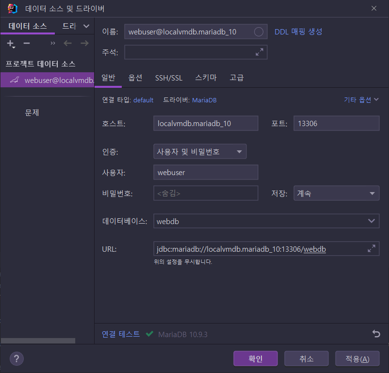

# 2장 웹과 데이터 베이스

> 도커로 MariaDB를 사용하고 있으니 그걸 사용하도록 하자~🎈
>
> * 프로젝트: [jdbcex](jdbcex)


## 2.1 JDBC 프로그래밍 준비

* ...

### MariaDB의 설치화 생성

* ...

#### MariaDB 설치

* ...

* Docker로 MariaDB 설치 

  ```sh
  docker run \
    --name mariadb_10.x \
    -v {호스트의 저장경로}:/var/lib/mysql \
    -e TZ="Asia/Seoul" \
    -e MARIADB_ROOT_PASSWORD='암호' \
    -p 13306:3306 \
    -d mariadb:10.9.3 \
    --character-set-server=utf8mb4 \
    --collation-server=utf8mb4_unicode_ci
  ```

  * 사용중인 버전은: `10.9.3`
  * 외부 포트: `13306`

  

#### 데이터베이스 생성과 사용자 계정 추가

* root 계정으로 접속해서 아래 내용 실행

  ```sql
  CREATE DATABASE webdb CHARACTER SET UTF8MB4;
  
  CREATE USER 'webuser'@'localhost' IDENTIFIED BY 'webuser';
  CREATE USER 'webuser'@'%' IDENTIFIED BY 'webuser';
  
  GRANT ALL PRIVILEGES ON webdb.* TO 'webuser'@'localhost';
  GRANT ALL PRIVILEGES ON webdb.* TO 'webuser'@'%';
  ```


### 프로젝트 생성과 MariaDB 준비

#### IntelliJ의  MariaDB 설정



* ...


#### 프로젝트내 MariaDB 설정

* build.gradle에 mariadb-java-client 디펜던시 추가

  ```groovy
  implementation "org.mariadb.jdbc:mariadb-java-client:${mariadbJavaClientVersion}"
  ```


#### JDBC 프로그램 작성 순서

* ...
  

### 실습_01 테스트 프로그램 작성하기

* ...


#### 실습_02 데이터베이스 테이블 생성

* TIMESTAMP 한계가 2037년까지면 얼마 안남은것 같다..?😅 새로 만들 때는 DATETIME 사용하는 것이 나을 것 같다.

* 물론 시간값이 해당 속성에 대해 전혀 무의미하면 DATE 타입이 좋음.👍

  ```sql
  CREATE TABLE tbl_todo (
      tno         INT AUTO_INCREMENT PRIMARY KEY,
      title       VARCHAR(100) NOT NULL,
      dueDate     DATE NOT NULL,
      finished    TINYINT DEFAULT 0
  );
  ```

  

#### 실습_03 데이터 insert

```sql
INSERT INTO tbl_todo (title, dueDate, finished)
VALUES ('Test...', '2022-12-31', 1);
```


#### 실습_04 데이터 select

```sql
SELECT * FROM tbl_todo WHERE tno < 10;
```


#### 실습05 데이터 업데이트

```sql
UPDATE tbl_todo
   SET finished = 0,
       title = 'Not yet...'
 WHERE tno = 3;
```


#### 실습_06 데이터 DELETE

```sql
DELETE 
  FROM tbl_todo
 WHERE tno > 5;
```


### DML과 쿼리(select)의 차이

* DML은 몇개의 데이터가 처리되었는지 숫자로 결과 반환
* SELECT 문은 데이터를 반환


#### JDBC 프로그래밍을 위한 API와 용어들

* java.sql.Connection
* java.sql.Statement / PreparedStatement
* java.sql.ResultSet
* Connection Pool 과 DataSource
* DAO (Data Access Object)
* VO (Value Object) 혹은 엔티티(Entity)


## 2.2 프로젝트 내 JDBC 구현

* ...

### Lombok 라이브러리

* ...

#### Lombok 라이브러리 추가

* 나는 이미 Gradle 플러그인으로 설정해서 그대로 쓰면 되겠다.

  ```groovy
  plugins {
    ...
    id "io.freefair.lombok" version "${lombokPluginVersion}"
    ...
  }
  ```


#### 실습_01 TodoVO 클래스의 작성

* ...


### HikariCP의 설정

* ...

* 디펜던시 추가

  ```groovy
    implementation "com.zaxxer:HikariCP:${hikaricpVersion}"
  ```


#### 실습_02 Connection Pool 이용하기

* ...

* 몇가지 데이터소스 프로퍼티 설정이 추가되어있던데... [HikariCP 홈페이지 기본 설정](https://github.com/brettwooldridge/HikariCP#rocket-initialization)대로 하신 것 같다.

  * `cachePrepStmts`: `true`

    > 기본적으로 캐시가 실제로 비활성화된 경우 `prepStmtCacheSize`,  `prepStmtCacheSqlLimit` 매개변수 중 어느 것도 영향을 미치지 않습니다. 이 매개변수를 `true`로 설정해야 합니다

  * `prepStmtCacheSize`: `250`

    > 이는 드라이버가 연결당 캐시할 준비된 명령문의 수를 설정합니다. 기본값은 보수적인 *25* 입니다 . *250-500* 사이로 설정하는 것이 좋습니다 .

  * `prepStmtCacheSqlLimit`: `2048`

    > 이것은 드라이버가 캐시할 준비된 SQL 문의 최대 길이입니다. MySQL 기본값은 *256* 입니다 . 우리의 경험, 특히 Hibernate와 같은 ORM 프레임워크에서 이 기본값은 생성된 명령문 길이의 임계값보다 훨씬 낮습니다. 권장 설정은 *2048* 입니다 .

    * https://github.com/brettwooldridge/HikariCP/wiki/
    * https://github.com/brettwooldridge/HikariCP/wiki/MySQL-Configuration


#### TodoDAO와 `@Cleanup`

* ...
* 나는 try-with-resource 가 더 나은 것 같은데.. `@Cleanup`까지 사용하는 건, 예측이 힘들 상황이 올것 같기도하고...😅 그래도 따라해보자~😎


#### 실습_03 TodoDAO의 등록 기능 구현하기

* ...

* LocalDate `->` java.sql.Date 변환

  ```java
  preparedStatement.setDate(2, Date.valueOf(vo.getDueDate()));
  ```


#### 실습_04 TodoDAO의 목록 기능 구현하기

* ...


#### 실습_05 TodoDAO의 조회 기능 구현하기

* ...


---

#### ✨ 중간 노트 ✨

테스트 할 때마다 DB를 초기화시키고 싶은데,...

MariaDB에서도 DROP의 CASCADE는 구현되지 않은 것 같다. MySQL에서 해결한 방법대로 프로시저를 추가해두자.

* JPA 스터디를 진행할 때, 외래키 관계가 복잡하더라도 한번에 모든 테이블을 지우기 위해서 MySQL 8에서 적용했었는데, MariaDB 10에서도 잘 동작한다.

* https://github.com/fp024/introduction-to-jpa-programming-study/issues/7

  ```sql
  DROP PROCEDURE IF EXISTS `drop_all_tables`;
  
  DELIMITER $$
  CREATE PROCEDURE `drop_all_tables`()
  BEGIN
      DECLARE _done INT DEFAULT FALSE;
      DECLARE _tableName VARCHAR(255);
      DECLARE _cursor CURSOR FOR
          SELECT table_name 
          FROM information_schema.TABLES
          WHERE table_schema = SCHEMA();
      DECLARE CONTINUE HANDLER FOR NOT FOUND SET _done = TRUE;
  
      SET FOREIGN_KEY_CHECKS = 0;
  
      OPEN _cursor;
  
      REPEAT FETCH _cursor INTO _tableName;
  
      IF NOT _done THEN
          SET @stmt_sql = CONCAT('DROP TABLE ', _tableName);
          PREPARE stmt1 FROM @stmt_sql;
          EXECUTE stmt1;
          DEALLOCATE PREPARE stmt1;
      END IF;
  
      UNTIL _done END REPEAT;
  
      CLOSE _cursor;
      SET FOREIGN_KEY_CHECKS = 1;
  END$$
  
  DELIMITER ;
  ```

  ---


## 의견

* ...
  
  

## 정오표

* ...


## 기타

* ...