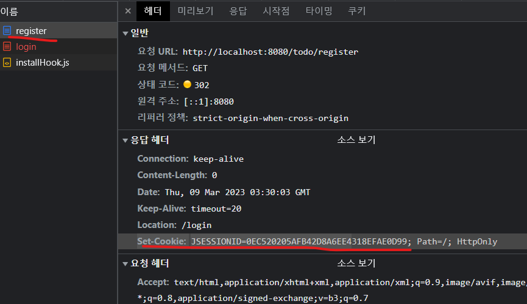
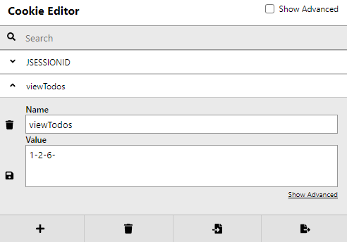

# 3장 세션/쿠키/필터/리스너

> 이번 장도 중요한 내용이다.✨ 서블릿의 기본 👍
>
> * 프로젝트: [w2](w2)


## 3.1 세션과 필터

* ...

### 무상태에서 과거를 기억하는 법

* ...

#### 쿠키를 생성하는 방법

* ...
* 서버에서 자동으로 생성되는 쿠키
* 개발자가 생성하는 쿠기


### 서블릿 컨텍스트와 세션 저장소

* ...

#### 세션을 통한 상태 유지 메커니즘

* ...

* HttpServletRequest의 getSession() 메서드를 호출하면 JSESSIONID 이름의 쿠키가 요청에 있었는지 확인하고 없으면 새로운 값을 만들어 세션 저장소에 보관

  > MockHttpServletRequest에서는 그냥 무조건 만들긴 했음..😉
  >
  > * https://jakarta.ee/specifications/platform/9/apidocs/
  > * https://javaee.github.io/javaee-spec/javadocs/
  >   * 10 버전은 클래스 검색시 문서가 링크가 깨진다.. 9 또는 8보는게 나을듯..


#### 프로젝트의 생성과 복사

* ...


#### HttpServletRequest의 getSession()

* ...
* 요청에 JSESSIONID 정보 유무에 다라 다음과 같이 동작
  * 있으면... : 
    * 세션 저장소에 새로운 ID로 공간을 만들고 해당 공간에 접근할 수 있는 객체를 반환
    * 새로운 ID는 부라우저에 JSESSION의 값으로 전송 (세션 쿠키)
  * 없으면... : 
    * 세션 저장소에서 JSESSIONID 값을 이용해서 할당된 공간을 찾고 이 공간에 접근할 수 있는 객체를 반환


### 세션을 이용하는 로그인 체크

* ...


#### 실습_01 등록할 때, 로그인 체크 하기

* ...
* 쿠키를 일부러 제거하고 등록(register) 서블릿에 접근하면 응답시 JSESSIONID 쿠키를 생성해준다.
  


#### 실습_02 로그인 처리 컨트롤러 작성하기

* ...


### 필터를 이용한 로그인 체크

* ...
* Filter에서 init(), destroy()가 default라서 필수 구현이 아님. 


#### 실습_03 로그인 체크 구현

* ...

* sendRedirect() 이후 바로 return으로 끝내지 않고 계속 진행해버리면.. (아래에서 `return;`을 빼먹으면...)

  ```java
     if (session.getAttribute("loginInfo") == null) {
        resp.sendRedirect("/login");
        return; // 끝내는것이 중요. 다음 필터로 넘기면 안 됨.
      }
  ```

  다음과 같은 예외가 발생함.

  ```
  java.lang.IllegalStateException: 응답이 이미 커밋된 후에는 forward할 수 없습니다.
  	at org.apache.catalina.core.ApplicationDispatcher.doForward(ApplicationDispatcher.java:285) ~[catalina.jar:10.1.7]
  	at org.apache.catalina.core.ApplicationDispatcher.forward(ApplicationDispatcher.java:277) ~[catalina.jar:10.1.7]
  	at org.fp024.w2.controller.TodoListController.doGet(TodoListController.java:31) [classes/:?]
  ```

  sendRedirect로 응답 주소가 정해졌는데.. TodoListController 까지 들어가서 forward코드를 만날때 예외가 나는 것 같다.

  ```java
        request.getRequestDispatcher(TODO_VIEW_ROOT.concat("/list.jsp")) //
            .forward(request, response); // 예외 발생
  ```

  
  

#### 실습_04 UTF-8 처리 필터

* ...


### 세션을 이용하는 로그아웃 처리

* ...


### 데이터베이스에서 회원 정보 이용하기

* ...


#### 실습_05 자바에서 회원 데이터 처리하기

* ...


#### 실습_06 컨트롤러에서 로그인 연동

* ...

###### EL에서 스트링 처리

* EL에서 기본으로 제공하는 param 객체를 이용해서 파라미터 값을 얻을 수 있음.

  ```jsp
  <c:if test="${param.result == 'error'}">
    <h1>로그인 에러</h1>
  </c:if>
  ```


##### EL의 Scope와 HttpSession 접근하기

* HttpServletRequest에 저장된 객체를 찾을 수 없다면 HttpSession 에 저장된 객체를 찾아내는 방식으로 동작함.

* EL의 스코프를 이용해서 접근하는 변수
  * Page Scope
  * Request Scope
  * Session Scope
  * Application Scope

* 변수에 없는 속성으로 조회하려면 예외남.

  ```
  Caused by: jakarta.el.PropertyNotFoundException: [name] 특성이 [org.fp024.w2.dto.MemberDTO] 유형에 없습니다.
  ```

  


## 3.2  사용자 정의 쿠키 (Cookie)

* ...

### 쿠키의 생성 전송

* ...
* 쿠키의 값은 URLEncoding된 문자열ㄹ ㅗ저장해야함.


#### 쿠키를 사용하는 경우

* ...


#### 실습_07 조회한 Todo 확인하기

* ...

* 봤던 TODO 번호 (tno)를 쿠키에 기록

  

  * 쿠키 조회부분을 `Optional<T>`로 변경해봤는데, 확실히 코드가 좋아졌다.


### 쿠키와 세션을 같이 활용하기

* ...

  

#### 자동 로그인 준비

* ...

##### 로그인 방식

* 사용자가 로그인할 때 임의의 문자열을 생성하고 이를 데이터베이스에 보관
* 쿠키에는 생성된 문자열을 값으로 삼고 유효기간은 1주일로 지정

##### 로그인 체크

* 현재 사용자의 HttpSession에 로그인 정보가 없는 경우에만 쿠키를 확인
* 쿠키의 값과 데이터베이스의 값을 비교하고 같다면 사용자의 정보를 읽어와서 HttpSession에 사용자 정보를 추가


#### 실습_08 자동 로그인 처리

* ...
* 로그아웃시, 몇몇 정리작업을 추가했다.
  * DB의 해당 회원 uuid 정보 삭제
  * remember-me 쿠키 삭제


## 3.3 리스너 (Listener)

* ...

### 리스너의 개념과 용도

* ...
* 옵저버(observer) 패턴
  * 특정한 변화를 구독(subscribe)하는 객체들을 보관하고 있다가 변화가 발생하면 구독 객체들을 실행(publish)하는 방식


### 실습_09 ServletContextListener

* ...


## 의견

* ...
  
  

## 정오표

* ...


## 기타

* ...